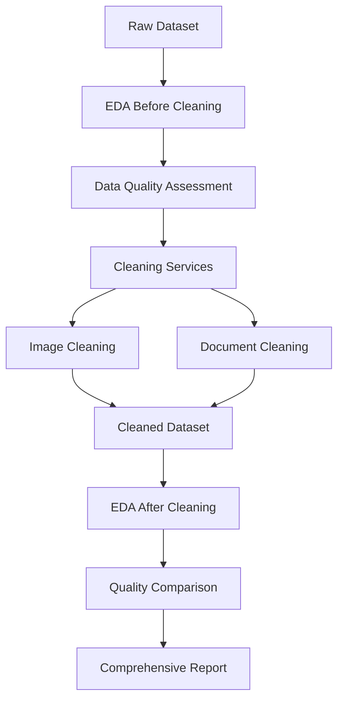

# 🔍 PS-05 EDA + Cleaning Services Integration Guide

This guide covers the **complete integration** of EDA (Exploratory Data Analysis) with our comprehensive cleaning services, creating a powerful data quality pipeline.

## 🎯 **What We've Built**

### **Complete Integration Pipeline:**
1. **EDA Service** (`backend/app/services/eda_service.py`) - Standalone EDA analysis
2. **Unified Cleaning Service** (`backend/app/services/unified_cleaning_service.py`) - Integrated cleaning + EDA
3. **API Endpoints** - RESTful access to all services
4. **Integration Script** (`scripts/eda_with_cleaning.py`) - Command-line interface
5. **Comprehensive Reporting** - Before/after analysis and comparisons

## 🚀 **Quick Start**

### **1. EDA Only Analysis**
```bash
# Run EDA analysis on your dataset
python scripts/eda_with_cleaning.py \
  --input data/train \
  --output results/eda_analysis \
  --mode eda_only
```

### **2. Cleaning with EDA Integration**
```bash
# Run complete cleaning with EDA before/after
python scripts/eda_with_cleaning.py \
  --input data/train \
  --output results/cleaned_with_eda \
  --mode cleaning_with_eda \
  --dataset-type auto
```

### **3. API Usage**
```bash
# Start the backend
cd backend && python -m uvicorn app.main:app --host 0.0.0.0 --port 8000

# Run EDA analysis via API
curl -X POST "http://localhost:8000/run-eda" \
  -F "files=@your_dataset.zip" \
  -F "dataset_name=my_dataset"

# Clean dataset with EDA
curl -X POST "http://localhost:8000/clean-dataset" \
  -F "files=@your_dataset.zip" \
  -F "dataset_name=my_dataset"
```

## 🔧 **API Endpoints**

### **New EDA Endpoints:**

#### **POST /run-eda**
Run standalone EDA analysis on uploaded dataset.

**Request:**
```bash
curl -X POST "http://localhost:8000/run-eda" \
  -H "Content-Type: multipart/form-data" \
  -F "files=@dataset.zip" \
  -F "dataset_name=eda_analysis"
```

**Response:**
```json
{
  "dataset_id": "uuid-here",
  "dataset_name": "eda_analysis",
  "num_files": 100,
  "total_size_gb": 0.5,
  "status": "eda_started",
  "message": "EDA analysis started in background"
}
```

#### **GET /eda-results/{dataset_id}**
Get EDA results for a specific dataset.

**Request:**
```bash
curl "http://localhost:8000/eda-results/uuid-here"
```

**Response:**
```json
{
  "dataset_id": "uuid-here",
  "eda_results": {
    "file_formats": {...},
    "image_properties": {...},
    "annotations": {...}
  },
  "timestamp": "2024-01-01T12:00:00"
}
```

### **Enhanced Cleaning Endpoints:**

#### **POST /clean-dataset** (Enhanced)
Now includes EDA before and after cleaning.

**Response includes:**
```json
{
  "dataset_id": "uuid-here",
  "eda_before_cleaning": {...},
  "image_cleaning": {...},
  "document_cleaning": {...},
  "eda_after_cleaning": {...},
  "combined_statistics": {...}
}
```

## 📊 **What EDA Analyzes**

### **1. File Format Analysis**
- **Total file counts** and format distribution
- **Image files**: PNG, JPG, JPEG, BMP, TIFF, TIF
- **Annotation files**: JSON, XML, TXT
- **Document files**: PDF, DOC, DOCX, PPT, PPTX
- **File type categorization** and statistics

### **2. Image Properties Analysis**
- **Dimensions**: Width, height, aspect ratios
- **File sizes**: Size distribution and statistics
- **Rotation detection**: Using Hough Line Transform
- **Quality metrics**: Laplacian variance for sharpness
- **Statistical summaries**: Min, max, mean, std for all properties

### **3. Annotation Analysis**
- **Class distribution**: Count of each annotation class
- **Bounding box statistics**: Width, height, area, aspect ratio
- **Quality validation**: Missing bbox, invalid bbox, missing class
- **Statistical analysis**: Using pandas for detailed bbox stats

### **4. Visualization Generation**
- **File format distribution**: Pie charts and bar plots
- **Image dimensions**: Scatter plots showing width vs height
- **Class distribution**: Bar charts for annotation classes
- **Bbox areas**: Histograms with log scale
- **Professional styling**: Using seaborn and matplotlib

## 🔄 **Integration Workflow**

### **Complete Pipeline:**



### **Step-by-Step Process:**

1. **Upload Dataset** → API receives files
2. **EDA Before Cleaning** → Analyze raw data quality
3. **Cleaning Pipeline** → Apply all 21 cleaning tasks
4. **EDA After Cleaning** → Analyze cleaned data quality
5. **Comparison Analysis** → Quantify improvements
6. **Report Generation** → Comprehensive markdown + JSON

## 📁 **Output Structure**

```
results/
├── eda_analysis/                    # EDA only results
│   ├── eda_report.md               # Human-readable report
│   ├── eda_results.json            # Raw analysis data
│   ├── file_formats.png            # Format distribution
│   ├── image_dimensions.png        # Dimension scatter plot
│   └── class_distribution.png      # Class distribution
│
├── cleaned_with_eda/                # Cleaning + EDA results
│   ├── cleaned_images/             # Cleaned image files
│   ├── cleaned_documents/          # Cleaned document files
│   ├── eda_before_cleaning/        # EDA results before
│   ├── eda_after_cleaning/         # EDA results after
│   ├── comprehensive_cleaning_report.json
│   └── comprehensive_eda_cleaning_report.md
```

## 🎯 **Use Cases**

### **1. Data Quality Assessment**
```python
from backend.app.services.eda_service import DatasetEDA

# Analyze raw dataset quality
eda = DatasetEDA("data/raw_dataset")
eda.run_complete_analysis("results/quality_assessment")
```

### **2. Pre-Cleaning Analysis**
```python
from backend.app.services.unified_cleaning_service import UnifiedCleaningService

# Run cleaning with EDA enabled
cleaner = UnifiedCleaningService()
results = cleaner.clean_dataset(
    input_dir=Path("data/raw"),
    output_dir=Path("data/cleaned"),
    run_eda=True  # This enables before/after EDA
)
```

### **3. Quality Monitoring**
```python
# Compare before/after quality
before_eda = results["eda_before_cleaning"]
after_eda = results["eda_after_cleaning"]

# Analyze improvements
improvements = cleaner.compare_eda_results(before_eda, after_eda)
```

### **4. Training Data Preparation**
```bash
# 1. Analyze raw training data
python scripts/eda_with_cleaning.py --input data/train --output results/eda_raw --mode eda_only

# 2. Clean and prepare training data
python scripts/eda_with_cleaning.py --input data/train --output results/training_prepared --mode cleaning_with_eda

# 3. Compare quality improvements
cat results/training_prepared/comprehensive_eda_cleaning_report.md
```

## 📈 **Quality Metrics & Insights**

### **Before Cleaning Analysis:**
- **File integrity**: Corrupt files, format issues
- **Data distribution**: Class imbalance, annotation quality
- **Image properties**: Rotation, dimensions, quality
- **Document structure**: Language diversity, text quality

### **After Cleaning Analysis:**
- **Quality improvements**: Removed corrupt files, standardized formats
- **Data enhancement**: Augmented images, cleaned annotations
- **Format consistency**: Standardized dimensions, normalized properties
- **Annotation validation**: Quality checks, bbox validation

### **Comparison Metrics:**
- **File count changes**: Before vs after
- **Quality improvements**: Corruption rates, duplication rates
- **Format standardization**: Consistency improvements
- **Annotation quality**: Validation results

## 🔧 **Configuration Options**

### **EDA Configuration:**
```python
eda_config = {
    "sample_size": 100,              # Images to analyze (prevents memory issues)
    "visualization_dpi": 300,        # Plot quality
    "report_format": "markdown",     # Report output format
    "include_quality_metrics": True  # Enable quality assessment
}
```

### **Cleaning + EDA Configuration:**
```python
cleaning_config = {
    "workflow": {
        "run_eda_before_cleaning": True,   # Enable pre-cleaning EDA
        "run_eda_after_cleaning": True,    # Enable post-cleaning EDA
        "save_intermediate_results": True,  # Save EDA results
        "generate_comparison": True         # Compare before/after
    }
}
```

## 🚨 **Troubleshooting**

### **Common Issues:**

#### **1. Memory Issues with Large Datasets**
```python
# Reduce sample size for EDA
config = {
    "eda_sample_size": 50  # Analyze fewer images
}
```

#### **2. Visualization Errors**
```python
# Use non-interactive backend
import matplotlib
matplotlib.use('Agg')  # Already configured in our service
```

#### **3. Import Errors**
```bash
# Ensure backend is in Python path
export PYTHONPATH="${PYTHONPATH}:$(pwd)/backend"
```

#### **4. File Permission Issues**
```bash
# Ensure write permissions for output directories
chmod -R 755 results/
```

## 📊 **Sample Reports**

### **EDA Report (Markdown):**
```markdown
# PS-05 Dataset EDA Report

## File Format Analysis
- Total files: 150
- Image files: 100
- Annotation files: 50

## Image Properties Analysis
- Images analyzed: 100
- Width range: 400 - 1200 pixels
- Height range: 600 - 1600 pixels
- Average rotation: 2.5° ± 1.8°

## Annotation Analysis
- Total annotations: 500
- Class distribution: Background(100), Text(200), Title(80)
```

### **Comprehensive Report:**
```markdown
# PS-05 Comprehensive EDA & Cleaning Report

## Executive Summary
- Analysis Type: Integrated EDA + Cleaning
- Status: Success
- Output Directory: results/cleaned_with_eda

## EDA Analysis - Before Cleaning
- Total Files: 150
- Image Files: 100
- Average Width: 800px

## EDA Analysis - After Cleaning
- Total Files: 380 (including augmented)
- Image Files: 380
- Quality: Enhanced

## Cleaning Results
- Images Cleaned: 95
- Corrupt Files Removed: 2
- Augmented Images: 285
```

## 🎉 **Benefits of Integration**

### **1. Data Quality Assurance**
- **Before cleaning**: Identify issues and plan cleaning strategy
- **After cleaning**: Validate cleaning effectiveness
- **Continuous monitoring**: Track quality improvements

### **2. Informed Decision Making**
- **Data insights**: Understand dataset characteristics
- **Cleaning strategy**: Choose appropriate cleaning methods
- **Quality metrics**: Quantify improvements

### **3. Training Optimization**
- **Data preparation**: Clean data for better model training
- **Augmentation planning**: Use EDA insights for augmentation
- **Quality validation**: Ensure training data quality

### **4. Production Readiness**
- **Automated pipeline**: API endpoints for production use
- **Background processing**: Handle large datasets efficiently
- **Comprehensive reporting**: Professional-quality outputs

## 🚀 **Next Steps**

1. **Test the integration** with your existing dataset
2. **Run EDA analysis** to understand data quality
3. **Apply cleaning services** with EDA monitoring
4. **Analyze improvements** using comparison reports
5. **Integrate into workflow** for continuous quality monitoring

## 📞 **Support & Resources**

- **Scripts**: `scripts/eda_with_cleaning.py`
- **Services**: `backend/app/services/eda_service.py`
- **API**: Enhanced cleaning endpoints
- **Documentation**: This guide + `CLEANING_SERVICES_GUIDE.md`

---

**🎯 You now have a complete, production-ready EDA + Cleaning pipeline that provides comprehensive data quality insights and validation!**
